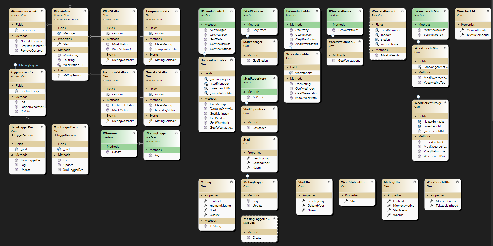

# Software_Ontwerp_2

# WeerEventsStart
# App om weerstations in bepaalde steden meting te laten doen en een weerbericht te genereren.

# Build & run instructies:
# Clone repository from Github: https://github.com/alexdelvoye/Software_Ontwerp_2.git.
# Open WeerEventsStart.snl in Visual Studio 2022.
# Klik op de groene play knop http.
# Visual Studio zal de solution builden en runnen.
# Er opent een console venster dat het programma aan het luisteren is op http://localhost:5008.

# Test Instructies:
# - Browser:
# Surf naar http://localhost:5008 voor algemene informatie.
# Surf naar http://localhost:5008/steden om de steden te bekijken waar de weerstations gelegen zijn.
# Surf naar http://localhost:5008/weerstations om de bestaande weerstations te bekijken.
# Surf naar http://localhost:5008/metingen om de gedane metingen van de weerstations te bekijken te bekijken.
# Surf naar http://localhost:5008/weerbericht om een weerbericht te bekijken gebaseerd op de gedane metingen.
# Surf naar http://localhost:5008/doemetingen om de weerstations nieuwe metingen te laten doen.

# - Visual Studio:
# Ga naar ApiCalls.http binnen de solution in Visual Studio.
# Druk op send request onder GET home voor algemene informatie.
# Druk op send request onder GET steden om de steden te bekijken waar de weerstations gelegen zijn.
# Druk op send request onder GET weerstations om de bestaande weerstations te bekijken.
# Druk op send request onder GET metingen om de gedane metingen van de weerstations te bekijken te bekijken.
# Druk op send request onder GET weerbericht om een weerbericht te bekijken gebaseerd op de gedane metingen.

# Druk op send request onder POST doemetingen om de weerstations nieuwe metingen te laten doen.

# - Log:
# Open log.json of log.xml om een log te zien van de gedane metingen.

# Known Issues:
# http://localhost:5008/doemetingen werkt niet, de weerstations doen geen nieuwe metingen.
# gebruik de POST in ApiCalls.http zoals beschreven hierboven beschreven onder - Visual Studio om
# nieuwe metingen te doen.

# Klassendiagram:
